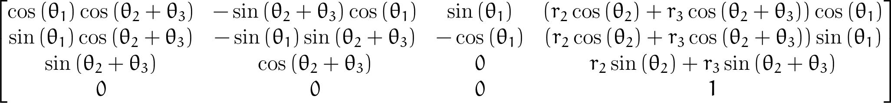

# Antropomorphic Arm

The aim of the project is to find forward kinematic and inverse kinematic equations of robotic arm with 3 degree of freedom by using `Denavit–Hartenberg` parameters.

  

## Structure

```text
.
├── launch
│   └── start_elipsoidal_motion.launch
├── output
├── src
│   └── antropomorphic_project
│       ├── utils
│       │   ├── __init__.py
│       │   ├── move_joints.py
│       │   └── rviz_marker.py
│       ├── __init__.py
│       ├── antropomorphic_end_effector_mover.py
│       ├── elipsoidal_motion.py
│       ├── fk_antropomorphic_arm.py
│       ├── generate_matrixes.py
│       └── ik_antropomorphic_arm.py
├── CMakeLists.txt
├── README.md
├── package.xml
└── setup.py
```

## Setup

#### Distribution

Use docker for quick-start (for both ROS1 or ROS2):

```bash
# using docker for ROS1
$ docker run -ti --rm --name local-ros-noetic ros:noetic
```

```bash
# using docker for ROS2
$ docker run -ti --rm --name local-ros-humble ros:humble
```

#### Build (Package)

Now, create a ros2 workspace, clone the package:

```bash
# setup directory
$ mkdir ~/ros2_ws/src/
$ git clone <repo_name> ~/ros2_ws/src/
```

Install the required packages (dependency) mentioned in `package.xml` using `apt`:

```bash
# check if package is available
$ ros2 pkg list
$ ros2 node list
```

```bash
# update path to installed packages
$ source /opt/ros/humble/setup.bash
```

To build locally or inside docker use the following commands:

```bash
# execute build
$ cd ~/ros2_ws && colcon build
$ source ~/ros2_ws/install/setup.bash
```

## Robot

Anthropomorphic robotic arms are designed to emulate the structure and function of human arms, typically featuring joints that mimic the shoulder, elbow, and wrist. Robotic arms possess degrees of freedom that allow them to perform movements.


**Note:** The above robot contains anthropomorphic arm with 3 degrees of freedom.

## Launch

#### Forward Kinematic

Forward kinematics in anthropomorphic robotic arms involves determining the position and orientation of the end effector (e.g., a tool or gripper) based on the specified joint angles. It calculates the spatial arrangement using the arm's geometric and joint parameters, mapping how each joint's movement affects the overall pose of the end effector.

```bash
# terminal 1
$ rosrun antropomorphic_project generate_matrixes.py
```

A `Denavit-Hartenberg` generic matrix for anthropomorphic robotic arms with 3 degree of freedom.


The Homogeneous Matrix for transforming from `Frame0` to `Frame3`.


The Homogeneous Matrix for transforming simplified for `Frame03`.



The node `fk_antropomorphic_arm.py` calculates position and orientation for `theta1`, `theta2`, and `theta3` joint values.

```bash
# terminal 2
$ rosrun antropomorphic_project fk_antropomorphic_arm.py 2.35 0.50 -2.24
```

```bash
...
Position    : [-0.50000, 0.50000, -0.50000]
Orientation : [0.11799, -0.69719, 0.70711] [-0.11799, 0.69719, 0.70711] [-0.98598, -0.16686, 0]
...
```

#### Inverse Kinematic

Inverse kinematics solves for the joint angles required to position the end effector of an anthropomorphic robotic arm at a desired location and orientation. This complex calculation reverses the forward kinematics process, often requiring optimization techniques to handle multiple potential solutions and adhere to physical constraints of the arm.

The node `ik_antropomorphic_arm.py` calculates joint values for `x`, `y`, and `z` position values.

```bash
# terminal 1
$ rosrun antropomorphic_project ik_antropomorphic_arm.py 0.5 0.6 0.7
```

```bash
...
 True  : [0.87606 -0.28804 2.03756]
 True  : [0.87606 1.74952 -2.03756]
 True  : [-2.26553 1.39207 2.03756]
 False : [-2.26553 -2.85356 -2.03756]
...
```

**Note:** `False` represents solution not possible physically due to robot joint limit.

To launch elipsoidal motion using `inverse kinematic` start simulation, rviz and launch `start_elipsoidal_motion.launch`.

```bash
# terminal 1
$ roslaunch antropomorphic_arm_gazebo main.launch
```

```bash
# terminal 2
$ rosrun rviz rviz
```

```bash
# terminal 3
$ roslaunch antropomorphic_project start_elipsoidal_motion.launch
```


## Specifications

#### Denavit-Hartenberg Parameters

Denavit-Hartenberg (DH) parameters are a standardized methodology used to simplify the mathematical description of the kinematics of a robotic arm. They provide a systematic way to define the geometry of a robot with respect to its joint configurations and are especially useful in both forward and inverse kinematics calculations.

There are four key parameters in the Denavit-Hartenberg convention:


- `θ` : `Theta`, the joint angle about the previous z-axis, from the old x-axis to the new x-axis.

- `d` : `Link Offset`, the offset along the previous z-axis to the common normal.

- `a` : `Link Length`, the length of the common normal, i.e., the distance between the z-axes.

- `α` : `Link Twist`, the angle about the common normal, from the old z-axis to the new z-axis.

## Roadmap

- [x] Task 1 : Find the Denavit-Hartenberg parameters.
- [x] Task 2 : Calculate the Forward Kinematics.
- [x] Task 3 : Calculate the Inverse Kinematics.
- [x] Task 4 : Move the robot arm using Inverse Kinematics.

See the [open issues](https://github.com/llabhishekll/antropomorphic_arm/issues) for a full list of proposed features (and known issues).

## Tools

System tool/modules used for project development.

- `Applications` : [vs-code](https://code.visualstudio.com/), [ros-extensions](https://marketplace.visualstudio.com/items?itemName=ms-iot.vscode-ros) and [docker-desktop](https://docs.docker.com/get-docker/).
- `ROS` : [ros-docker-images](https://hub.docker.com/_/ros/) (`humble`, `noetic`) or [build-source](https://www.ros.org/blog/getting-started/).

## License

Distributed under the MIT License. See `LICENSE.txt` for more information.
